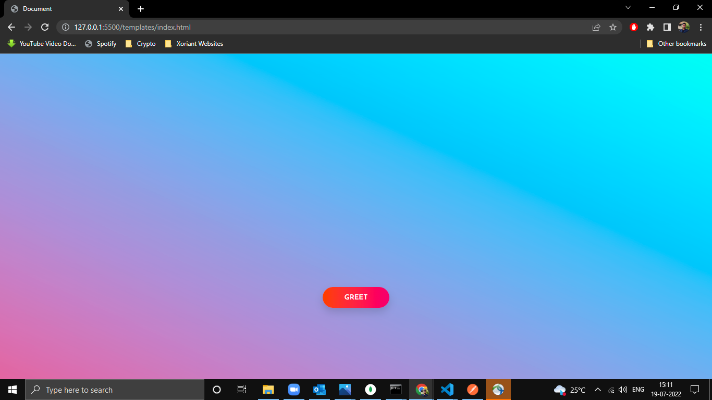
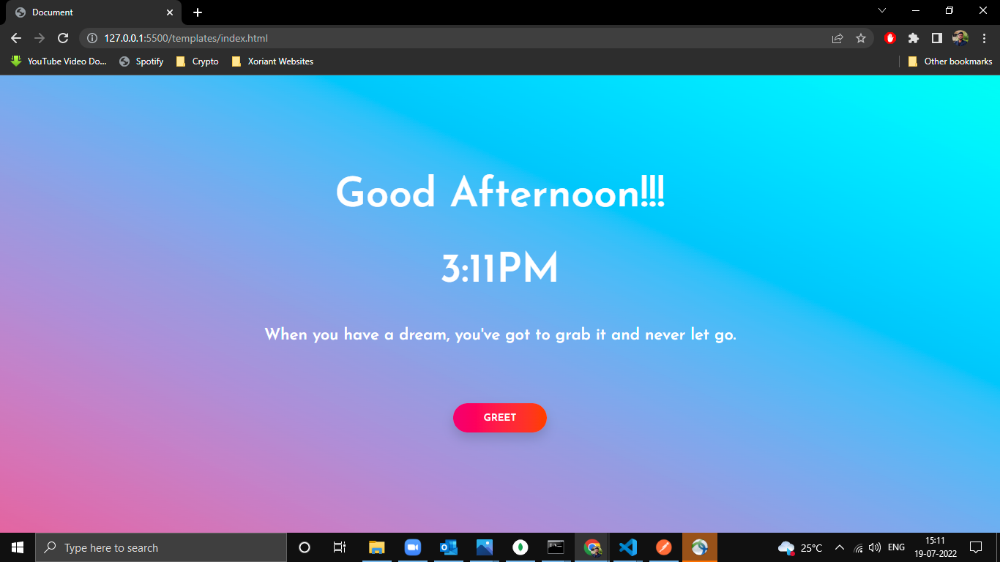

# Simple Web Server

## Description

This is a simple API built using gin gonic (Golang) . This application greets user according to the current time zone of user.
* Go, also known as Golang, is an open-source, compiled, and statically typed programming language designed by Google. It is built to be simple, high-performing, readable, and efficient.

* Gin is a high-performance micro-framework that can be used to build web applications and microservices. It makes it simple to build a request handling pipeline from modular, reusable pieces. It does this by allowing you to write middleware that can be plugged into one or more request handlers or groups of request handlers.

----

## Pre-requisites
 Install Golang
 * [Installation for Windows](https://go.dev/doc/install) 
 * [Installation for Linux](https://golangdocs.com/install-go-linux)

 Install Gin-Gonic 
 
 * [Command to Install Gin-Gonic](https://gin-gonic.com/docs/)


 ---
 ## Getting Started

 1. Clone the repository using:
 ```
 git clone https://github.com/code-moro/Web_Server.git
 ```
 2. Install Gin Gonic Framework
 ```
 go get -u github.com/gin-gonic/gin
 ```
 3. Start Server
```
cd .\Backend\
go run main.go
```
 
 4. Vist the Given link and hit Greet button
```
http://127.0.0.1:5500/templates/index.html
```

---
## API Endpoints

## /wish 
  
 When User clicks the Greet Button on Home page Api call is made to backend which returns Greetings , Current Time and Motivational Quotes.
  
### Before Making API Call 


---
### After Making API Call




 
